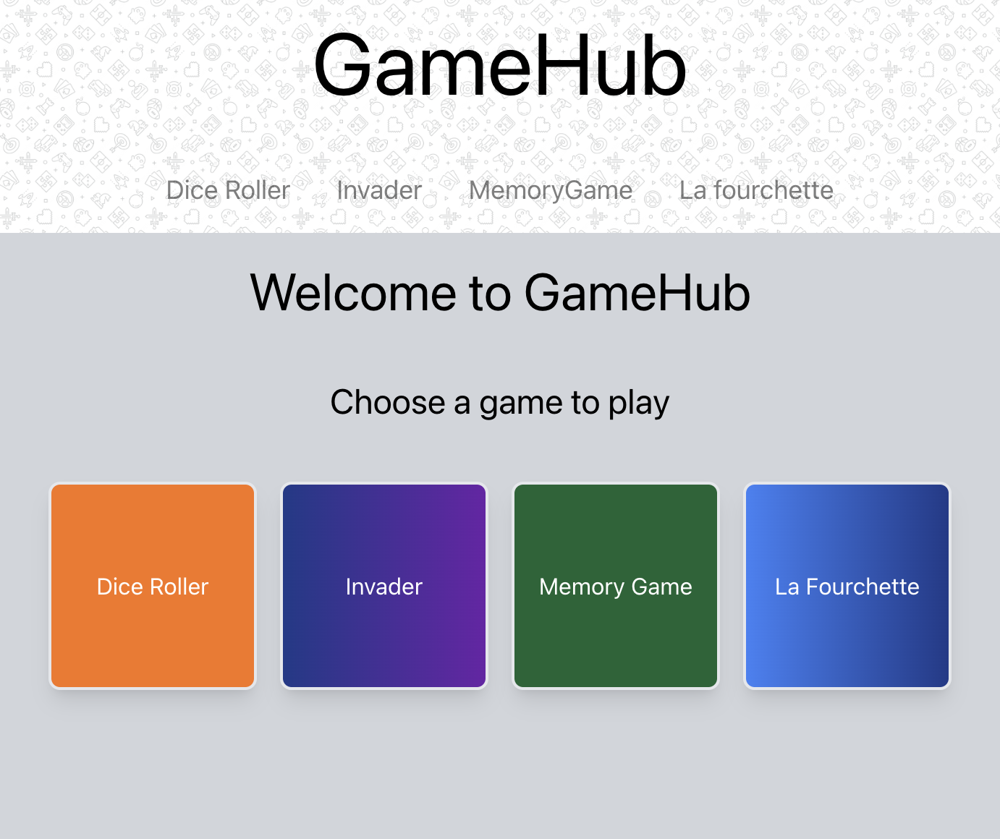
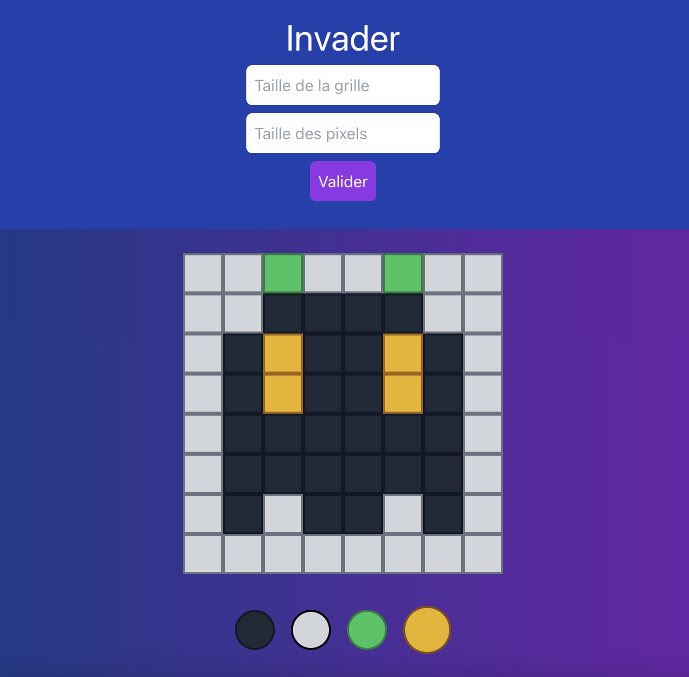
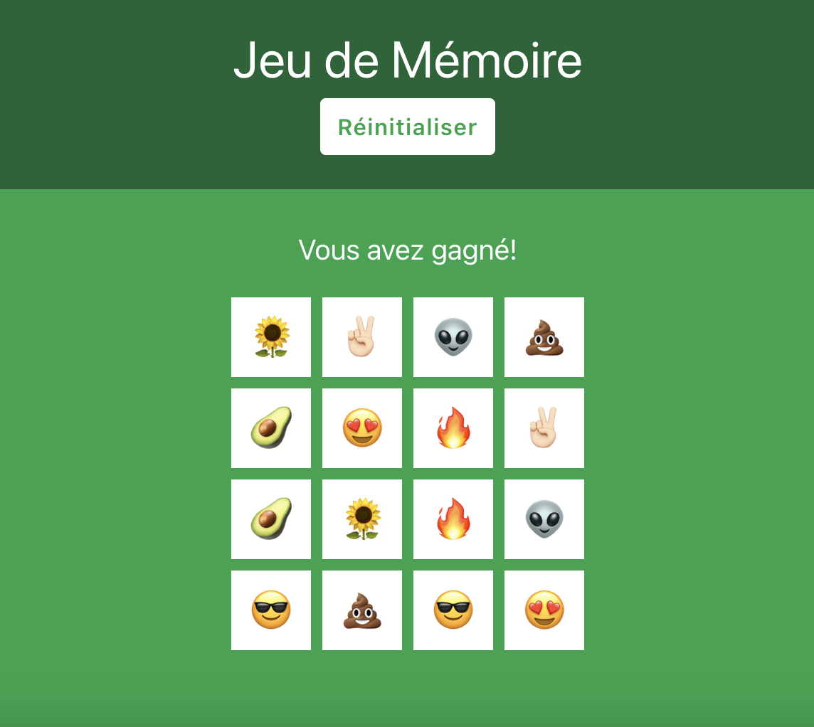
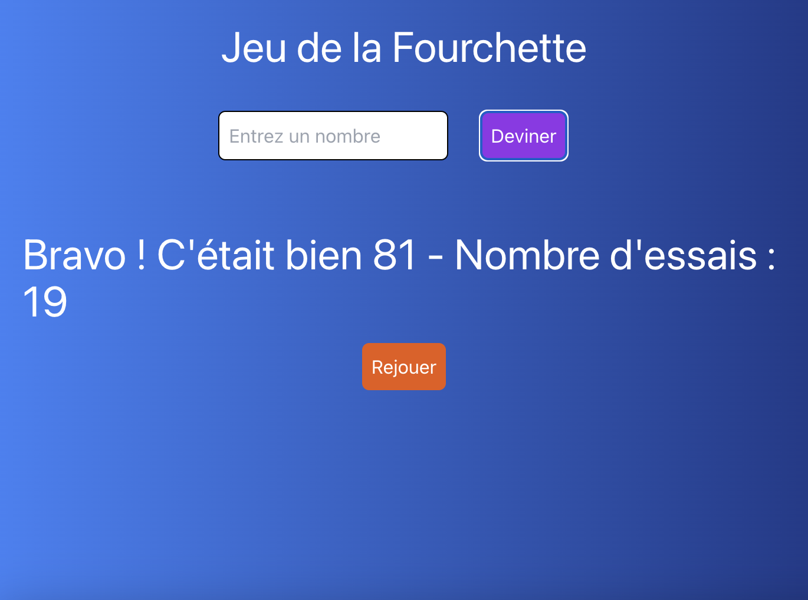
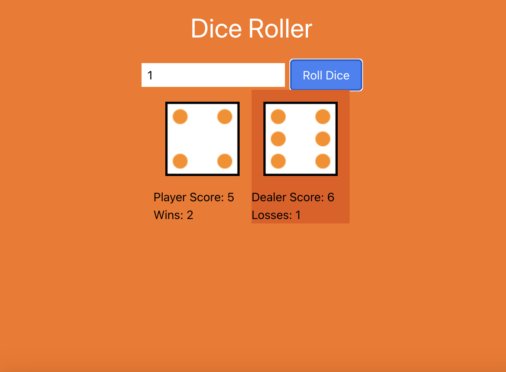

# GameHub

GameHub est une application web regroupant quatre mini-jeux divertissants et addictifs. Cette application a pour but de fournir une plateforme unique où les utilisateurs peuvent accéder à différents jeux et s'amuser.



## Table des matières

- [Fonctionnalités](#fonctionnalités)
- [Mini-jeux](#mini-jeux)
- [Installation](#installation)
- [Utilisation](#utilisation)
- [Contribuer](#contribuer)
- [Licence](#licence)

## Fonctionnalités

- Accédez à quatre mini-jeux différents à partir d'une seule plateforme.
- Interface utilisateur simple et intuitive.
- Design réactif pour une expérience optimale sur tous les appareils.
- Options de personnalisation pour chaque mini-jeu.

## Mini-jeux

1. **Invader** : Un jeu de peinture de pixels où les utilisateurs peuvent créer et personnaliser des grilles de pixels.
   
2. **Memory Game** : Un jeu de mémoire où les utilisateurs doivent trouver toutes les paires d'images correspondantes.
   
3. **Jeu de la Fourchette** : Un jeu où les utilisateurs doivent deviner un nombre exact en utilisant des indices de fourchette.
   
4. **Dice Roller** : Un jeu où les utilisateurs peuvent lancer des dés virtuels et obtenir des résultats aléatoires.
   

## Installation

### Prérequis

- Node.js (version 12 ou ultérieure)
- npm (version 6 ou ultérieure) ou yarn (version 1 ou ultérieure)

### Étapes d'installation

1. Clonez le dépôt GitHub :

   ```bash
   git clone https://github.com/votre-utilisateur/gamehub.git
   ```

2. Accédez au répertoire du projet :

   ```bash
   cd gamehub
   ```

3. Installez les dépendances nécessaires :

   ```bash
   npm install
   ```

   ou

   ```bash
   yarn install
   ```

4. Lancez l'application :

   ```bash
   npm run dev
   ```

   ou

   ```bash
   yarn run dev
   ```

5. Ouvrez votre navigateur et accédez à `http://localhost:3000`.

## Utilisation

### Navigation

- Après avoir démarré l'application, vous serez accueilli par la page d'accueil de GameHub.
- Sélectionnez un des mini-jeux disponibles pour commencer à jouer.

### Invader

1. Cliquez sur **Invader** dans le menu principal.
2. Personnalisez la taille de la grille et des pixels.
3. Sélectionnez une couleur et commencez à peindre sur la grille.

### Memory Game

1. Cliquez sur **Memory Game** dans le menu principal.
2. Commencez le jeu et essayez de trouver toutes les paires d'images correspondantes.
3. Cliquez sur une carte pour la retourner et révéler l'image.
4. Trouvez la paire correspondante pour chaque image.

### Jeu de la Fourchette

1. Cliquez sur **Jeu de la Fourchette** dans le menu principal.
2. Devinez le nombre exact en utilisant les indices de fourchette (plus haut ou plus bas).
3. Entrez un nombre et soumettez votre devinette.
4. Continuez à deviner jusqu'à ce que vous trouviez le nombre exact.

### Dice Roller

1. Cliquez sur **Dice Roller** dans le menu principal.
2. Sélectionnez le nombre de dés à lancer.
3. Cliquez sur le bouton pour lancer les dés et obtenir des résultats aléatoires.
4. Consultez les résultats des dés et relancez si nécessaire.

## Contribuer

Les contributions sont les bienvenues ! Pour contribuer :

1. Forkez le dépôt.
2. Créez une branche pour votre fonctionnalité (`git checkout -b fonctionnalite-nouvelle`).
3. Commitez vos modifications (`git commit -am 'Ajoutez une nouvelle fonctionnalité'`).
4. Poussez votre branche (`git push origin fonctionnalite-nouvelle`).
5. Créez une Pull Request.

## Licence

Ce projet est sous licence MIT. Consultez le fichier [LICENSE](LICENSE) pour plus de détails.
